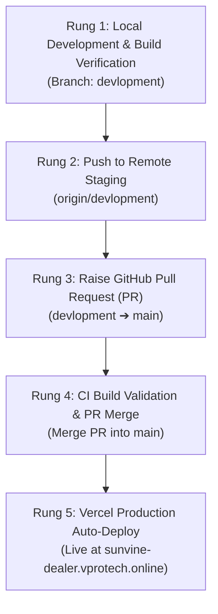

# Sunvine Portal — Ladder Deployment & Main Branch Protection Policy

This document establishes the mandatory **Ladder Deployment Workflow** for the Sunvine Dealer & Admin Quotation Portal.

---

## The 5-Rung Deployment Ladder

Under no circumstances should code be committed directly to `main`. Every change must climb the ladder sequentially:



---

## Detailed Step-by-Step Procedure

### Rung 1: Local Feature Development (`devlopment`)
- Always ensure active local branch is `devlopment`:
  ```bash
  git checkout devlopment
  git pull origin devlopment
  ```
- Make code changes, verify UI and business logic.
- Run local production build test to ensure zero errors:
  ```bash
  npm run build
  ```

### Rung 2: Push to Remote Staging (`origin/devlopment`)
- Stage and commit changes to local `devlopment`:
  ```bash
  git add .
  git commit -m "feat/fix: descriptive summary of changes"
  ```
- Push directly to `devlopment`:
  ```bash
  git push origin devlopment
  ```

### Rung 3: Raise Pull Request (`devlopment` $\to$ `main`)
- Open a Pull Request targeting base `main` with head `devlopment`.
- Can be created directly via GitHub Web UI or through the Antigravity GitHub integration tool (`create_pull_request`).
- PR template checklist must be validated.

### Rung 4: Review, CI Validation & Merge
- GitHub Actions CI (`.github/workflows/ci.yml`) runs automated build checks against the PR.
- Once checks pass and code is reviewed, merge PR into `main` using squash or standard merge (`merge_pull_request`).

### Rung 5: Vercel Production Deployment
- Vercel monitors `main` branch only.
- Merging the PR triggers an automatic production build and deployment to:
  `https://sunvine-dealer.vprotech.online`
- Production `main` remains protected from accidental breakage or unreviewed commits.

---

## Summary (हिंदी सारांश)

1. **Rung 1**: Saara development aur testing hamesha `devlopment` branch par hoga.
2. **Rung 2**: Code pehle `origin/devlopment` par push hoga.
3. **Rung 3**: GitHub par `devlopment` se `main` branch ke liye PR (Pull Request) raise hoga.
4. **Rung 4**: CI verification pass hone ke baad PR ko `main` branch me merge kiya jayega.
5. **Rung 5**: Jaise hi PR merge hoga, Vercel automatically `main` branch se production deploy kar dega.
